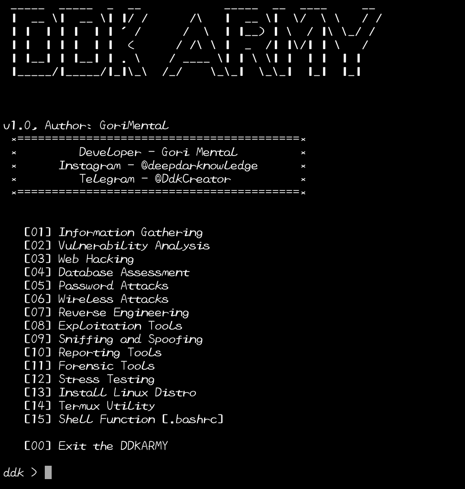

# DDKARMY
DDKARMY tools installer is very easy to use, only provided for N00B termux users, just kidding.
DDKARMY is a tool that is specially made for termux user which provides a lot of tool mainly used tools in termux, DDKARMY install any of the given tools provided by it from itself with just one click, and DDKARMY always get updated.

Made with ❤️

## Screenshot


### Requirements
• Python 3.x

#### Installation and Using DDKARMY
```
apt install python git -y
```
```
git clone https://github.com/Deepdarknowledge/ddk.git
```
```
cd ddk
```
```
python DDKARMY.py
```

### Contact Me
Instagram: https://instagram.com/deepdarknowledge  
Telegram : https://t.me/DdkCreator
